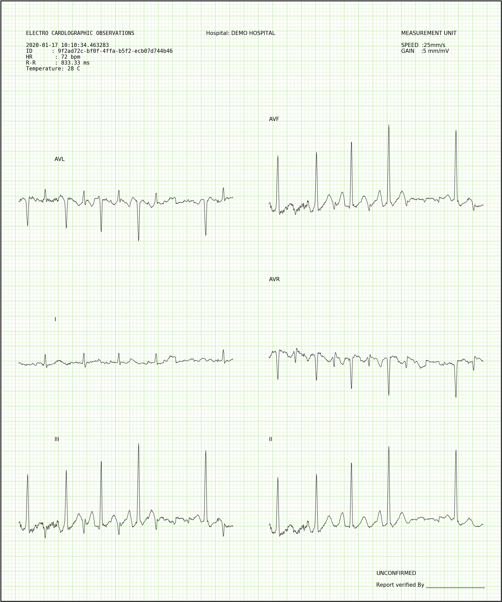

## This project exposes rest end points to generate ECG report

##### Sample output


##### About
This is a simple code to generate image and pdf for ecg or any signal using python [matplotlib](https://matplotlib.org/).
Example datafile are available [in data directory](data)

##### Run
```python app.py```

##### Generate report
```curl 'http://localhost:8080/app/ecg'```

##### Note
Please refer requirements.txt for appropriate version of modules. This code is version dependent.
Tested on Python 3.7.1 (Windows)